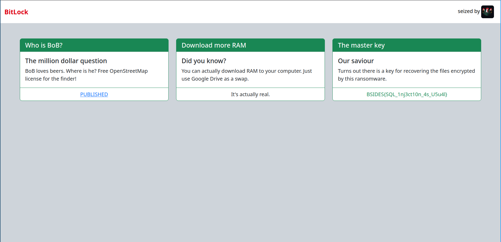

# Writeup

This is a very simple SQL injection challenge with some tricks to stop users who can only use tools for exploitation.

Spotting the issue is pretty easy:
```rust
// Why should I use prepared statements? I can just use format string lol. plaintext password storage ftw
let mut stmt = match db.prepare(
    format!("SELECT * FROM users WHERE username = '{username}' AND password = '{password}'")
        .as_str(),
)
```

We can inject anything to the end of the SELECT query.

The database is generated by the following script:
```bash
#!/bin/sh

sqlite3 users.db <<SQL
CREATE TABLE users (username VARCHAR(255), password VARCHAR(255));
SQL
```

There is only an empty table called `users` in the database. We clearly need to use a union-based SQL injection to pass the check.
Automatized tools can't be used for exploiting the server without modification because there is a basic xor encryption applied to the request body.

Let's try the following payload: `' UNION SELECT 1,1--` This will fail? Why?

Because some of the SQL keywords are removed in a case-insensitive way.
```rust
// Sanitize the input using poor man's WAF
body = utils::remove_sql_keywords(body.as_str());
```

```rust
pub fn remove_sql_keywords(data: &str) -> String {
    let pattern = Regex::new("(?i)(UNION|SELECT|AND|UPDATE)").unwrap();

    return pattern.replace_all(data, "").into_owned();
}
```

This filter is not recursive so we can easily bypass it.
The final payload is: `' UNUNIONION SESELECTLECT 1,1--`



Flag: `BSIDES{SQL_1nj3ct10n_4s_U5u4l}`